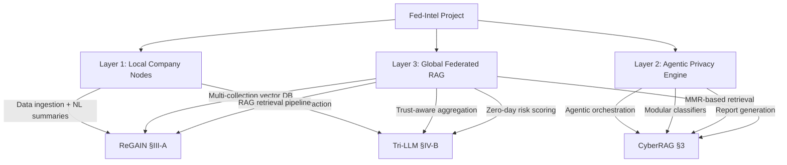

# Deep Analysis — Three Baseline Papers

---

## Paper 1: ReGAIN

| | |
| --- | --- |
| **Full Title** | ReGAIN: Retrieval-Grounded AI Framework for Network Traffic Analysis |
| **arXiv** | [2512.22223](https://arxiv.org/abs/2512.22223) — Dec 2025 |
| **Core Idea** | RAG + LLM for explainable, citation-backed intrusion detection |

### ReGAIN Architecture

```bash
Raw Telemetry → Deterministic NL Summary → Embedding (384-d) → Multi-Collection Vector DB
                                                                        ↓
User Query → Metadata Filter → Bi-Encoder Search → Cross-Encoder Rerank → MMR Diversity
                                                                        ↓
                                                              GPT-4 LLM Reasoning
                                                                        ↓
                                                    Human-Readable Verdict + Citations
```

**4 Components:**

1. **Data Ingestion** — Converts logs/CSVs/PCAPs into NL summaries via deterministic function
2. **Vector Knowledge Base** — 3 collections: *telemetry*, *anomaly*, *heuristic* (ChromaDB, 384-d embeddings)
3. **Retrieval Engine** — Multi-stage: metadata filtering → bi-encoder → cross-encoder rerank → MMR → abstention mechanism
4. **LLM Analysis** — GPT-4 generates explanations with explicit citations to traffic records

### Key Techniques

- **Abstention mechanism**: Returns diagnostic feedback instead of hallucinating when retrieval quality is low
- **Multi-collection architecture**: Separates knowledge into specialized collections for precision
- **Citation-backed output**: Every verdict links to specific traffic evidence

### ReGAIN Evaluation

| Attack | Accuracy | Precision | Recall | Dataset |
| --- | --- | --- | --- | --- |
| TCP SYN Flood | **98.82%** | ~91% | ~98.6% | MAWILab, 10K instances |
| ICMP Ping Flood | **95.95%** | ~74.5% | **100%** | MAWILab, 10K instances |

Outperforms: Snort-style rules, Random Forest, SVM, KNN, LSTM

### ReGAIN Limitations

- GPT-4 via remote API → latency, cost, not real-time
- Ping Flood precision gap (74.5%) due to benign ICMP resembling attacks
- Single-node only — no federated or multi-org sharing
- No agentic behavior — LLM is passive (answers queries only)

---

## Paper 2: Tri-LLM

| | |
| --- | --- |
| **Full Title** | Tri-LLM Cooperative Federated Zero-Shot Intrusion Detection with Semantic Disagreement and Trust-Aware Aggregation |
| **arXiv** | [2602.00219](https://arxiv.org/abs/2602.00219) — Jan 2026 |
| **Core Idea** | Federated IDS where 3 LLMs generate semantic attack prototypes for zero-shot detection |

### Tri-LLM Architecture

```bash
┌─────────────── Tri-LLM Ensemble (NOT federated, external) ───────────────┐
│  GPT-4o          DeepSeek-V3        LLaMA-3-8B                           │
│  (contextual     (stable, low-      (expressive,                         │
│   reasoning)      variance)          fine-grained)                       │
│                                                                          │
│  3 perspectives per attack: offensive / defensive / evasion strategy     │
│  → Fused into semantic prototypes via weighted combination               │
└──────────────────────────────┬────────────────────────────────────────────┘
                               │ Shared prototypes (not raw data)
         ┌─────────────────────┼─────────────────────┐
    ┌────▼────┐           ┌────▼────┐           ┌────▼────┐
    │Client 1 │           │Client 2 │           │Client 3 │
    │x → W·x  │           │x → W·x  │           │x → W·x  │
    │(project  │           │(project  │           │(project  │
    │ to       │           │ to       │           │ to       │
    │ semantic │           │ semantic │           │ semantic │
    │ space)   │           │ space)   │           │ space)   │
    └────┬────┘           └────┬────┘           └────┬────┘
         │ W_i updates         │                     │
         └─────────────────────┼─────────────────────┘
                          ┌────▼─────────────────┐
                          │ Trust-Aware Server    │
                          │ τ_i = 1/(L_i + ε)    │
                          │ α_i = τ_i / Σ τ_j    │
                          │ + entropy monitoring  │
                          └──────────────────────┘
```

**Key components:**

1. **Semantic Prototype Construction** — Each LLM generates embeddings for attack categories from 3 perspectives; fused via weighted average
2. **Local Projection** — Each client maps traffic features x ∈ ℝ^d into shared semantic space via lightweight linear projection ẑ = W·x
3. **Trust-Aware Aggregation** — Clients with high semantic alignment loss get lower aggregation weight; entropy monitoring detects instability
4. **Zero-Shot Inference** — Cosine similarity matching against prototypes + zero-day risk score combining disagreement + similarity

### Key Mathematical Formulations

| Concept | Formula |
| --- | --- |
| Inter-LLM Disagreement | D_a = (1/M(M-1)) Σ ‖z_a^(m) − z_a^(n)‖² |
| Trust Score | τ_i = 1/(L_i + ε) |
| Aggregation Weight | α_i = τ_i / Σ τ_j |
| Zero-Day Risk | ZDS(x) = λ·D_â + (1−λ)·(1 − cos(ẑ, z_â)) |
| Zero-Shot Attribution | â = argmax cos(ẑ, z_a) |

### Tri-LLM Evaluation

- **80%+ zero-shot accuracy** on unseen attack patterns
- **10%+ improvement** over similarity baselines for zero-day discrimination
- Low aggregation instability even with compromised clients
- Evaluated on IoT/IIoT traffic datasets

### Tri-LLM Limitations

- LLMs are **static encoders**, not agentic (no log reading, no actions)
- **No RAG** — uses semantic embeddings only, no retrieval-augmented generation
- **No privacy sanitization** — relies on FL to keep data local, doesn't actively strip PII
- **No explainability** — no human-readable explanations or citation-backed reasoning
- Requires GPT-4o API for prototype generation

---

## Paper 3: CyberRAG

| | |
| --- | --- |
| **Full Title** | CyberRAG: An Agentic RAG Cyber Attack Classification and Reporting Tool |
| **arXiv** | [2507.02498](https://arxiv.org/abs/2507.02498) — Jul 2025 (revised Sep 2025) |
| **Core Idea** | Agentic RAG with modular classifiers + iterative retrieval + structured reporting |

### CyberRAG Architecture

```bash
Internet Traffic → IDS/Firewall → Flagged Alert
                                      │
                                      ▼
                        ┌─────────────────────────┐
                        │    Core LLM Engine       │
                        │   (Central Agent)        │
                        │   Orchestrates tools     │
                        │   + generates reports    │
                        └─────┬──────────┬─────────┘
                              │          │
                    ┌─────────▼──┐  ┌────▼──────────┐
                    │Classification│  │   RAG Tool    │
                    │   Tool       │  │               │
                    │              │  │ 3 Vector DBs: │
                    │ BERT-based   │  │ • CVE/NVD     │
                    │ classifiers: │  │ • OWASP/MITRE │
                    │ • SQLi model │  │ • Literature  │
                    │ • XSS model  │  │               │
                    │ • SSTI model │  │ MMR retrieval  │
                    │ • (add more) │  │ → summarize   │
                    └──────────────┘  └───────────────┘
                              │          │
                              ▼          ▼
                    ┌─────────────────────────┐
                    │ Attack Description +    │
                    │ Report Generation       │
                    │ → structured narrative  │
                    │ → CVEs, mitigations     │
                    └────────────┬────────────┘
                                 │
                                 ▼
                    ┌─────────────────────────┐
                    │ Interactive Chat        │
                    │ "Why was this SSTI?"    │
                    │ → adaptive by expertise │
                    │ → patching guidance     │
                    └─────────────────────────┘
```

**4 Components:**

1. **Classification Tool** — Ensemble of fine-tuned BERT/RoBERTa classifiers, one per attack family. Highest confidence wins. Extensible — add new classifiers without retraining agent.
2. **RAG Tool** — 3 specialized vector stores (CVE/NVD, OWASP/MITRE, scientific literature). MMR-based retrieval for relevance + diversity.
3. **Report Generation** — Core LLM synthesizes classification + RAG into structured attack description with CVEs, severity, and mitigations.
4. **Interactive Chat** — Analyst can ask follow-up questions; adapts to expertise level.

### What Makes It "Agentic"

- Core LLM acts as **autonomous orchestrator** — decides control flow
- **Iterative retrieval** — can re-query knowledge base to refine understanding (not single-pass)
- **Tool invocation** — dynamically calls classification and RAG tools as needed
- Uses **LangChain/LlamaIndex** style agentic patterns

### CyberRAG Evaluation

| Metric | Result |
| --- | --- |
| Classification Accuracy | **94.92%** across SQLi, XSS, SSTI |
| Per-class Accuracy | **>94%** each |
| BERTScore (explanations) | **0.94** |
| GPT-4 Expert Evaluation | **4.9/5** |
| Robustness | Tested against adversarial and unseen payloads |

### Key Design Choices

- **Open-weight encoder models** for classifiers (fine-tunable, reproducible)
- **Proprietary decoder models** (GPT-4) only as core engine (swappable)
- **No fine-tuning of agent** — extend via knowledge base updates
- Built with **FAISS** for vector storage

### CyberRAG Limitations

- **Single-node only** — no federated architecture
- **Web attacks only** — SQLi, XSS, SSTI (no network-level DDoS, Ping Flood, etc.)
- **No privacy** — no PII stripping, no differential privacy
- GPT-4 dependency for core engine

---

## Cross-Paper Comparison

| Capability | ReGAIN | Tri-LLM | CyberRAG |
| --- | --- | --- | --- |
| **RAG** | ✅ Multi-collection | ❌ | ✅ Multi-source |
| **Agentic LLM** | ❌ Passive | ❌ Static encoder | ✅ Autonomous agent |
| **Federated** | ❌ | ✅ Trust-aware | ❌ |
| **Zero-shot / Zero-day** | ❌ | ✅ | ⚠️ Partial (unseen payloads) |
| **Explainability** | ✅ Citations | ❌ | ✅ Reports + chat |
| **Privacy** | ❌ | ⚠️ Data stays local via FL | ❌ |
| **Modular classifiers** | ❌ | ❌ | ✅ Per-attack-family |
| **Interactive** | ✅ Conversational | ❌ | ✅ Chat interface |
| **Attack types** | Network (DDoS, Ping) | Network (IoT/IIoT) | Web (SQLi, XSS, SSTI) |
| **LLMs used** | GPT-4 | GPT-4o + DeepSeek-V3 + LLaMA-3-8B | GPT-4 + BERT classifiers |
| **Vector DB** | ChromaDB | — | FAISS |
| **Accuracy** | 95–98% | 80%+ zero-shot | 94.9% |

---

## How All Three Feed Into Fed-Intel



| Fed-Intel Component | Primary Reference | What to Borrow |
| --- | --- | --- |
| Data ingestion → NL summaries | **ReGAIN** | Deterministic summarization function, 5-tuple schema |
| Multi-collection vector KB | **ReGAIN** | ChromaDB, telemetry/anomaly/heuristic collections |
| Retrieval pipeline | **ReGAIN** + **CyberRAG** | Metadata filter → bi-encoder → cross-encoder → MMR |
| Agentic log analysis | **CyberRAG** | Core LLM engine as autonomous orchestrator |
| Modular attack classifiers | **CyberRAG** | BERT-family fine-tuned per attack type |
| PII stripping prompt design | **CyberRAG** (adapted) | Agent prompt engineering for sanitization |
| Federated model training | **Tri-LLM** | Lightweight projection model, only weights shared |
| Trust-aware aggregation | **Tri-LLM** | Loss-driven trust weighting + entropy monitoring |
| Zero-day risk scoring | **Tri-LLM** | Inter-model disagreement as uncertainty signal |
| Citation-backed reports | **ReGAIN** | Explicit evidence references in LLM output |
| Interactive analyst chat | **CyberRAG** | Follow-up Q&A, expertise-adaptive responses |

> [!IMPORTANT]
> **The gap none of these papers fill:** Active PII sanitization (stripping IPs, payloads, user data from threat summaries before sharing). This is Fed-Intel's unique contribution — the agentic LLM that *reads* logs and *outputs* privacy-safe summaries. This must be designed from scratch.
